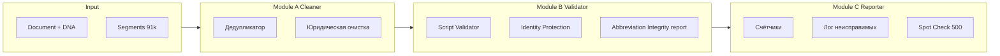

# План: модуль Validator-Janitor (Batch & Patch)

## Цель

Автоматическая верификация и программное исправление результатов перевода по правилам Document DNA для любого направления (RU→EN, EN→RU, RU→KZ и т.д.): один проход по сегментам без LLM, флаги ошибок, отчёт и опциональная запись исправлений в БД. Поведение задаётся конфигурацией (Профиль валидации / DNA), а не зашитым направлением.

## Стек реализации

**Node.js/TypeScript только.** Реализация в текущем бэкенде (скрипт + сервис), без добавления Python. Переиспользование DNA, нормализации и логики из `translation.service.ts` и Prisma; один рантайм, одна кодовая база.

## Архитектура

---

## Универсальное направление (конфигурационная архитектура)

Поведение Janitor не зашито под RU→EN. Все направленно-специфичные параметры берутся из **Профиля валидации**, подгружаемого вместе с DNA (или из расширения DNA, например `validationSettings`).

| Элемент                   | Узкий вариант                       | Универсальный вариант                                                                                                                                       |

| ------------------------- | ----------------------------------- | ----------------------------------------------------------------------------------------------------------------------------------------------------------- |

| Запрет «лишнего» алфавита | Жёстко «Cyrillic Ban»               | **Script Validator**: в конфиге массив `forbiddenScripts` (напр. `["cyrillic"]` для RU→EN, `["latin"]` для EN→RU). Код ищет символы из заданных диапазонов. |

| Юридическая очистка       | Ключевое слово `hereinafter` в коде | В конфиге массив/объект `legalKeywords` (напр. `["hereinafter"]` для EN, `["далее"]` для RU). Паттерн строится из этих слов.                                |

| Слово в regex             | `\b\w+\b` (ASCII)                   | **Unicode:** `(\p{L}+)` с флагом `u`. Один и тот же паттерн работает для «UPS UPS» и «ЕЭС ЕЭС».                                                             |

| Глоссарий                 | «ERS – ERS»                         | **Identity Protection**: если в строке формата `A – B` значение A посимвольно равно B — восстановить расшифровку из DNA (правило уже абстрактное).          |

| Отчёты                    | Тексты на английском                | Шаблоны с переменными направления (sourceLocale/targetLocale) или ключи i18n.                                                                               |

**Pre-flight check:** перед массовой обработкой проверить первые N сегментов (напр. 10). Если в конфиге направление RU→EN, а в целевом тексте преобладает кириллица (или наоборот) — прервать с ошибкой «Направление в DNA не совпадает с текстом».

---

## 1. Модуль А: Дедупликатор (The Cleaner)

**Где:** расширить [backend/src/services/translation.service.ts](backend/src/services/translation.service.ts).

**Уже есть:**

- Скобочный дубль и цепочка слов в `collapseConsecutiveDuplicateWords`. Для универсальности заменить `\b\w+\b` на **Unicode** `(\p{L}+)` (флаг `u`), чтобы работало и для «UPS UPS», и для «ЕЭС ЕЭС».

**Добавить:**

- **«Юридическая очистка»**: функция `removeLegalKeywordRedundant(text: string, legalKeywords: string[]): string`. Ключевые слова (напр. `hereinafter`, `далее`) берутся из конфига (DNA/validationSettings: `legalKeywords`). Паттерн: слово перед скобкой совпадает с словом после одного из ключевых слов внутри скобок — удалять скобочную конструкцию. Пример: `ID (hereinafter ID)` → `ID`; для RU можно задать `["далее"]`. Regex строится динамически из `legalKeywords` с экранированием; группа слова — Unicode `(\p{L}+)`.

**Сборка «патча»:** `runJanitorCleaner(text: string, options?: { legalKeywords?: string[] }): string` вызывает (1) `removeLegalKeywordRedundant(text, options?.legalKeywords ?? [])`, (2) `collapseConsecutiveDuplicateWords` с Unicode-паттернами. Единая точка входа; при отсутствии legalKeywords шаг (1) можно пропускать.

---

## 2. Модуль Б: Валидатор соответствия DNA

**Где:** новый файл [backend/src/services/validatorJanitor.ts](backend/src/services/validatorJanitor.ts). DNA и нормализация — через [backend/src/services/analysis.service.ts](backend/src/services/analysis.service.ts) (`getDocumentDna`) и [backend/src/services/dnaSchema.ts](backend/src/services/dnaSchema.ts) (`normalizeDocumentDnaPayloadOrNull`).

**Правила (универсальные):**

- **Script Validator (вместо «Cyrillic Ban»):** в DNA/конфиге поле `forbiddenScripts` — массив, напр. `["cyrillic"]` для RU→EN, `["latin"]` для EN→RU. Для каждого сегмента проверять наличие символов из запрещённых диапазонов (кириллица `[\u0400-\u04FF]`, латиница — выбранный диапазон). При наличии — флаг `FORBIDDEN_SCRIPT` (или сохранить имя `CRITICAL_CYRILLIC` как alias для обратной совместимости). Автозамену не делать.
- **Identity Protection (глоссарий):** строка формата «Key – Value» ([DEFINITION_LINE_REGEX](backend/src/services/translation.service.ts)). Если A и B посимвольно совпадают (нормализация trim/регистр) — восстановить расшифровку из DNA: по ключу (shortForm или исходному ключу) взять longForm и подставить. Работает для любого направления (ERS – ERS → ERS – Electric Regime Service; обратный перевод защищается тем же правилом).
- **Abbreviation Logic Integrity:** без авто-замены. Токены в целевом тексте сверять с DNA (ключи + shortForm); неизвестные аббревиатуроподобные токены — в отчёт как «подозрительный транслит». Белый список частых слов (или параметр в конфиге) по желанию.

**Вход:** сегмент (текст), нормализованный DNA, конфиг валидации (forbiddenScripts, при необходимости legalKeywords). Выход: исправленный текст, массив флагов ошибок.

---

## 3. Модуль В: Статистический репортер

**Где:** тот же [backend/src/services/validatorJanitor.ts](backend/src/services/validatorJanitor.ts) (или отдельный `validatorJanitorReporter.ts`).

**Собирать за один проход по сегментам:**

- Счётчики: юридическая очистка, скобочный дубль, цепочки слов, строки глоссария (Identity Protection), сегменты с запрещённым скриптом (FORBIDDEN_SCRIPT), предупреждения Abbreviation Integrity.
- Лог неисправимых: массив `{ segmentId, segmentIndex?, errorType: 'FORBIDDEN_SCRIPT' | 'SUSPICIOUS_ABBREV', detail?: string }`.
- Отчёты: шаблоны с переменными направления (sourceLocale/targetLocale) или ключи для последующей локализации.
- Spot-check: после обработки всех сегментов сгенерировать 500 случайных segmentId (или segmentIndex) из обработанного списка (например, `segmentIds.sort(() => Math.random() - 0.5).slice(0, 500)`), записать в отчёт для ручной проверки.

**Формат отчёта:** объект (JSON) с полями: `documentId`, `direction`, `totalSegments`, `counts` (объект с счётчиками), `unfixable` (массив логов), `spotCheckSegmentIds` (массив до 500 id).

---

## 4. Точка входа и направление

**Варианты:**

- **Скрипт:** [backend/src/scripts/validator-janitor.ts](backend/src/scripts/validator-janitor.ts) — аргумент `documentId`. Загрузка документа (`sourceLocale`, `targetLocale`), DNA через `getDocumentDna(documentId)` и нормализация. Из DNA или профиля подгружать **Профиль валидации** (forbiddenScripts, legalKeywords, при необходимости validationSettings). Загрузка сегментов (id, segmentIndex, targetMt, targetFinal); текст для проверки — `targetFinal ?? targetMt`.
- **API (опционально):** `POST /api/documents/:id/validator-janitor` с телом `{ dryRun?: boolean }`. При `dryRun: false` — запись исправлений в сегменты.

**Pre-flight check:** перед массовой обработкой взять первые N сегментов (напр. 10). По конфигу направления и forbiddenScripts проверить: если ожидается целевой текст без кириллицы, а в выборке преобладает кириллица (или наоборот) — прервать с ошибкой «Направление в DNA не совпадает с текстом» и не запускать обработку 91k строк.

**Направление:** не ограничивать только RU→EN. Направление задаётся документом (sourceLocale/targetLocale); конфиг валидации (forbiddenScripts, legalKeywords) подбирается по направлению или хранится в DNA.

---

## 5. Порядок выполнения для одного документа

1. Загрузить документ и DNA; нормализовать DNA; подгрузить конфиг валидации (forbiddenScripts, legalKeywords) по направлению документа.
2. **Pre-flight:** проверить первые 10 сегментов на соответствие направления и forbiddenScripts; при несовпадении — останов с ошибкой.
3. Загрузить все сегменты документа (пагинация или запрос с лимитом 100k).
4. Для каждого сегмента:

  - Текст = `targetFinal ?? targetMt ?? ''`.
  - **Cleaner:** `runJanitorCleaner(text, { legalKeywords })` (юридическая очистка по конфигу + collapseConsecutiveDuplicateWords с Unicode).
  - **Validator:** Script Validator (forbiddenScripts), Identity Protection (Key=Value → longForm из DNA), сбор подозрительных аббревиатур.
  - Сохранить исправленный текст и флаги; обновить счётчики и лог неисправимых.

5. Сформировать spot-check (500 id), вывести отчёт (JSON); при необходимости — batch update сегментов в БД.

---

## 6. Производительность и ограничения

- Один линейный проход по сегментам, без вызовов LLM и без тяжёлых операций на сегмент (несколько regex, обращение к Map по shortForm). Ожидаемо укладываться в десятки секунд для 91k сегментов при реализации на TypeScript в Node.
- Обновление БД: при включённом patch — батчевое обновление (например, `prisma.segment.updateMany` по пачкам или цикл `update` по изменённым id), чтобы не держать 91k отдельных транзакций.

---

## 7. Зависимости от существующего кода

| Компонент                                                                  | Использование                                                                                                                                                                                                        |

| -------------------------------------------------------------------------- | -------------------------------------------------------------------------------------------------------------------------------------------------------------------------------------------------------------------- |

| [translation.service.ts](backend/src/services/translation.service.ts)      | `collapseConsecutiveDuplicateWords`, константа DEFINITION_LINE_REGEX, нормализация abbreviationLogic (getLongFormForDedupe / extractAbbreviationFromValue или buildLongFormToShortFormPairs для shortForm→longForm). |

| [analysis.service.ts](backend/src/services/analysis.service.ts)            | `getDocumentDna(documentId)`.                                                                                                                                                                                        |

| [dnaSchema.ts](backend/src/services/dnaSchema.ts)                          | `normalizeDocumentDnaPayloadOrNull` для приведения abbreviationLogic к виду longForm/shortForm.                                                                                                                      |

| [spot-check-translation.ts](backend/src/scripts/spot-check-translation.ts) | Можно расширить отчётом Validator-Janitor или оставить отдельным скриптом; spot-check 500 дублировать в новом отчёте.                                                                                                |

| Prisma Segment                                                             | Поля: id, segmentIndex, targetMt, targetFinal — для чтения и опционального обновления.                                                                                                                               |

| Prisma Document                                                            | sourceLocale, targetLocale — направление и подбор конфига валидации (forbiddenScripts, legalKeywords).                                                                                                               |

---

## 8. Итоговый чек-лист реализации

1. **translation.service.ts:** (1) В `collapseConsecutiveDuplicateWords` перейти на Unicode-паттерны `\p{L}+` (флаг `u`). (2) Добавить `removeLegalKeywordRedundant(text, legalKeywords)` и экспортировать `runJanitorCleaner(text, options?)` с опциональным `legalKeywords`.
2. **DNA/конфиг:** расширить схему или документ-профиль полями валидации: `forbiddenScripts?: string[]`, `legalKeywords?: string[]` (при отсутствии — дефолты под RU→EN для обратной совместимости).
3. **validatorJanitor.ts:** типы (флаги FORBIDDEN_SCRIPT, SUSPICIOUS_ABBREV, отчёт); Script Validator по forbiddenScripts; Identity Protection (Key=Value → longForm из DNA); эвристика подозрительных аббревиатур; агрегация счётчиков и лога; spot-check 500; pre-flight по первым N сегментам; `runValidatorJanitor(documentId, options?)` с поддержкой dryRun и конфига по направлению.
4. **validator-janitor.ts (скрипт):** documentId из argv, загрузка документа и DNA, подгрузка конфига валидации, вызов `runValidatorJanitor`, вывод JSON отчёта.
5. (Опционально) **documents.routes.ts:** `POST /documents/:id/validator-janitor` с телом `{ dryRun?: boolean }`.

После реализации — тест на документе RU→EN (напр. «Свод.docx (43)»); при добавлении EN→RU или RU→KZ достаточно задать в конфиге другие forbiddenScripts и legalKeywords без смены кода.