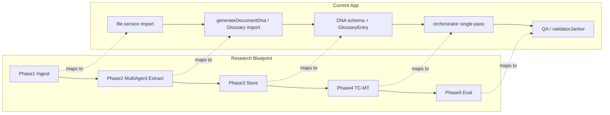

# Terminology Extractor Blueprint Mapping

## Summary

The research report *AI Translation Terminology Extractor Research* defines a 5-phase architecture for terminology extraction and glossary management: (1) data ingestion and preprocessing, (2) multi-agent terminology extraction, (3) glossary storage and schema, (4) terminology-constrained machine translation integration, and (5) continuous evaluation. This document maps each phase to the current AI Translation Studio codebase, records gaps between the research blueprint and the existing DNA and glossary implementation, and recommends an implementation priority order (P0–P4).

---

## Phase 1: Data ingestion and preprocessing

**Research:** AI-driven document parsing (e.g. MinerU, LangExtract), text normalization (whitespace, encoding), and language-specific lemmatization (spaCy, Lindera) to reduce dimensionality and noise before extraction.

**Current app:**

- Document and segment ingestion: [backend/src/services/file.service.ts](backend/src/services/file.service.ts) handles document processing and can trigger `generateDocumentDna` after import.
- No MinerU or LangExtract; no dedicated lemmatization step before DNA generation or glossary lookup.
- Normalization is ad hoc (e.g. in DNA key validation and key normalization).

**Gap:** No shared preprocessing or lemmatization pipeline before extraction or translation. Source text is not reduced to lemmas before glossary/DNA matching.

**Relevant code:**

- `backend/src/services/file.service.ts` — document import and optional DNA generation
- `backend/src/services/analysis.service.ts` — DNA generation consumes document/segments
- `backend/src/services/glossary.service.ts` — glossary lookup; no lemma normalization of input

---

## Phase 2: Multi-agent terminology extraction

**Research:** Four specialized agents: Extraction (LLM with syntactic few-shot, optionally hybrid PyATE/C-value), Quality Control (LLM-as-judge on term pairs), Normalization (format and orthography), Standardization and deduplication (equivalent term sets).

**Current app:**

- **DNA:** [backend/src/services/analysis.service.ts](backend/src/services/analysis.service.ts) — `generateDocumentDna` and `refineDocumentDna` use a single LLM flow; prompts live in [backend/src/services/dnaPrompts.ts](backend/src/services/dnaPrompts.ts). Optional synthesis in [backend/src/services/dnaSynthesis.service.ts](backend/src/services/dnaSynthesis.service.ts). CSV-based enrichment in [backend/src/services/dnaEnrichment.service.ts](backend/src/services/dnaEnrichment.service.ts).
- **Glossary:** Project- and document-level term pairs; manual entry and CSV import via [backend/src/services/glossaryImport.service.ts](backend/src/services/glossaryImport.service.ts). No LLM-based extraction into the glossary; no QC or deduplication agents.

**Gap:** No multi-agent split; no syntactic few-shot in DNA prompts; no PyATE hybrid; no LLM-as-judge for term quality; no dedicated normalization or deduplication agents. Glossary has no extractor—only import and manual add.

**Relevant code:**

- `backend/src/services/analysis.service.ts` — `generateDocumentDna`, `refineDocumentDna`
- `backend/src/services/dnaPrompts.ts` — DNA generation/refinement prompts
- `backend/src/services/dnaSynthesis.service.ts` — synthesis workflow
- `backend/src/services/dnaEnrichment.service.ts` — CSV enrichment
- `backend/src/services/glossary.service.ts` — glossary CRUD
- `backend/src/services/glossaryImport.service.ts` — glossary CSV import

---

## Phase 3: Glossary storage and database schema

**Research:** term_id (UUID), source/target lang and term, pos_tag, context_metadata (JSON), approval_status (lifecycle). Rich termbases with POS and usage context.

**Current app:**

- **DNA:** Stored in analysis/document context; schema in [backend/src/services/dnaSchema.ts](backend/src/services/dnaSchema.ts): `technicalSchema`, `namingConventions`, `abbreviationLogic`, `entityGroups`. Key length 500, value 2000; no explicit POS or approval lifecycle in the DNA schema.
- **Glossary:** Prisma model used by [backend/src/services/glossary.service.ts](backend/src/services/glossary.service.ts) — sourceTerm, targetTerm, sourceLocale, targetLocale, status (CANDIDATE / PREFERRED / DEPRECATED), contextRules, notes; optional embeddings. No pos_tag; no structured context_metadata JSON as in the research.

**Gap:** DNA has no approval_status field; glossary has no pos_tag or rich context_metadata. The research’s “equivalent term set” / deduplication is not a first-class concept in the schema.

**Relevant code:**

- `backend/src/services/dnaSchema.ts` — DNA payload schema and limits
- `backend/prisma/schema.prisma` — GlossaryEntry, and wherever document DNA is stored (e.g. AnalysisResult or document-level)

---

## Phase 4: TC-MT integration

**Research:** Contextual retrieval (lemma-based glossary lookup), base NMT/LLM generation without hard constraints, then a separate LLM refinement step to inject terminology with correct inflection (translate-then-refine).

**Current app:**

- Single-pass translation: [backend/src/ai/orchestrator.ts](backend/src/ai/orchestrator.ts) receives `documentDna` and `documentGlossary` (loaded in [backend/src/services/ai.service.ts](backend/src/services/ai.service.ts)), formats both into the prompt (“PROJECT KNOWLEDGE BASE” and glossary section). No separate refinement step. No lemma-based retrieval; glossary and DNA are used via prompt context only.

**Gap:** No translate-then-refine; no lemma normalization of source for glossary lookup; terminology is enforced only via prompt, not via a second refinement LLM call.

**Relevant code:**

- `backend/src/ai/orchestrator.ts` — `formatDocumentDnaForPrompt`, `buildGlossarySection`, `formatGlossaryTermsForHierarchy`
- `backend/src/services/ai.service.ts` — loads documentDna and documentGlossary and passes them to the orchestrator

---

## Phase 5: Continuous evaluation

**Research:** Offline evaluation (e.g. G-Eval), Terminology Success Rate, Window Overlap (n-gram concordance), periodic sampling, LLM-as-judge with rubrics.

**Current app:** QA and validator/janitor flows in [backend/src/services/quality.service.ts](backend/src/services/quality.service.ts) and [backend/src/services/validatorJanitor.ts](backend/src/services/validatorJanitor.ts). No LLM-as-judge or G-Eval-style terminology rubrics; no continuous terminology success rate or window-overlap metrics.

**Gap:** No structured terminology evaluation pipeline; no LLM-as-judge for term correctness or fluency.

**Relevant code:**

- `backend/src/services/quality.service.ts`
- `backend/src/services/validatorJanitor.ts`
- Any existing evaluation or telemetry

---

## Implementation priorities (recommendation)

| Priority | Phase   | Action |
|----------|---------|--------|
| **P0**   | Phase 2 | Improve extraction quality: add syntactic few-shot to DNA prompts and/or a small QC step (LLM-as-judge on a sample of extracted terms) before saving; optionally add glossary-from-document extraction (LLM) that writes into the existing glossary. |
| **P1**   | Phase 4 | Introduce an optional translate-then-refine path for segments with many glossary/DNA terms (e.g. second LLM call: “refine to apply these terms with correct inflection”). |
| **P2**   | Phase 1 | Add optional lemmatization (e.g. spaCy) for source text before glossary lookup and before DNA extraction to improve matching and consistency. |
| **P3**   | Phase 3 | Extend glossary schema (pos_tag, context_metadata) and DNA lifecycle (approval_status) if rich termbases become a product requirement. |
| **P4**   | Phase 5 | Add terminology-specific evaluation (term success rate + LLM-as-judge or G-Eval rubrics) for continuous monitoring. |

---

## Blueprint vs current app (overview)

